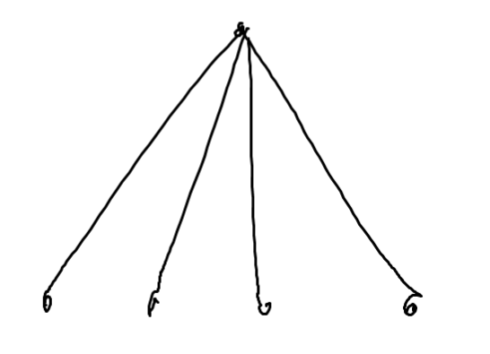
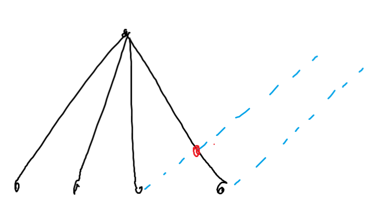
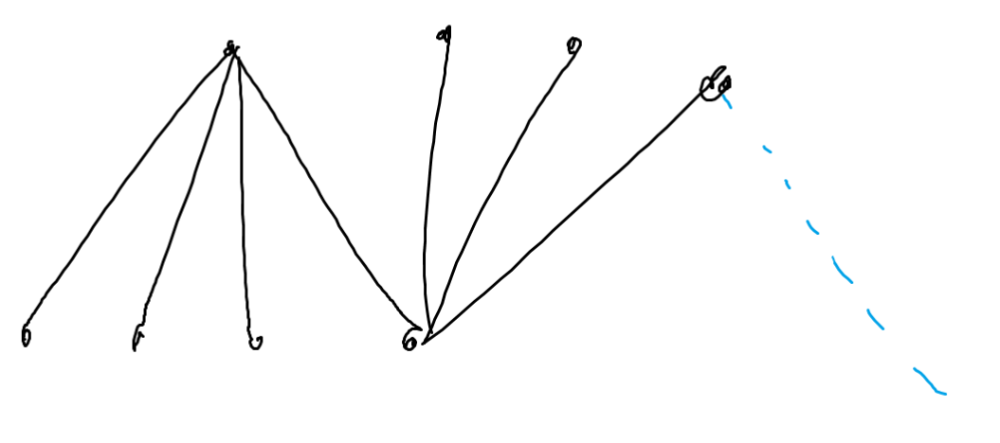
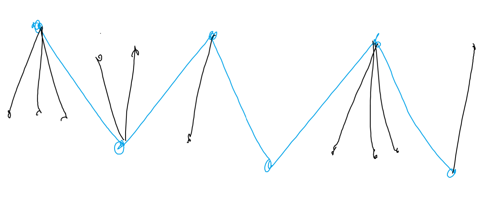

Байшингуудаар оройг, гүүрүүдээр ирмэгийг илэрхийлээд граф гэж сэтгэе.\
Нэг компонентийн 2 оройн дунд өөр компонентийн орой байж болохгүй. Иймд нийт $C$ ширхэг компонент байдаг гэвэл, компонент тус бүрд боломжийн тоог олж тэдгээрийн үржвэрийг эдгээр компонентуудыг сэлгэх боломжийн тоо $C!$-аар үржүүлснээр хариу гарна. Одоо харин нэг компонентийн хувьд хэдэн боломжтойг яаж олохыг бодъё.

Оройн зэрэг нь 1-ээс их байх оройг том орой гээд зураг дээрх шиг дээд талын хамгийн зүүн талд нь том орой байсан гэе.

Хөршүүдийннх нь ядаж 2 нь том орой бол тэдгээрээс гарсан ирмэгүүд баруун тийш явах хэрэгтэй болох ба ингэхэд заавал огтлолцол үүснэ.

Иймд зөвхөн энэ дээд талын  хамгийн зүүн талд байгаа оройн хувьд ихдээ 1 л хөрш том орой байж болох ба тэр нь заавал доод талдаа эдгээр хөршүүдийнхээ хамгийн баруун талд нь байх ёстой. Бусад хөршүүд нь хоорондоо яаж ч сэлгэж болно. Харин тэр нэг том хөрш цаашаагаа дахиад ганц л том оройтой хөрш байж болох ба тэр нь хөршүүдийнх нь хамгийн баруун талд байх ёстой. 2 том хөршүүдийн дунд орсон том биш оройнууд дотроо яаж ч сэлгэж болно.

Адилхан зарчимаар цааш үргэлжлүүлвэл жишээ нь ийм болно. Энэ тохиолдолд том оройнуудын (зураг дээр цэнхэр өнгөтэй) байршил энэ чигээрээ бэхлэгдсэн гэвэл бусад том биш оройнуудыг дотор нь сэлгэх боломжийн тоо $3!\cdot2!\cdot1!\cdot0!\cdot3!\cdot1!$ болох юм.

Зөвхөн том оройнуудаар тогтсон дэд граф нь заавал шулуун граф байх тул 2 захын оройн аль нь зүүн талдаа орох, мөн дээрээс нь тэр нь дээр эсвэл доороо орох гээд нийт 4 боломжоор эдгээр том оройнуудын байрлал тодорхой болно. Иймд 2 захын том оройнуудыг $x,y$, тэр 2-оос бусад том оройн олонлогийг $V$, $u$ оройн зэргийг $deg(u)$ гэвэл нийт боломжийн тоо $`4\cdot(deg(x)-1)!\cdot(deg(y)-1)!\cdot\prod\limits_{u \in V}(deg(u)-2)!`$ болно. Энэ нь ядаж 2 том оройтой байх тохиолдол бөгөөд $0$ эсвэл $1$ ширхэг том оройтой үед төстэй байна.

**Time complexity:** $O(n\alpha(n))$ (DSU ашигласан учраас $\alpha(n)$ байгаа)\
[Submission](https://codeforces.com/contest/2127/submission/332834214)